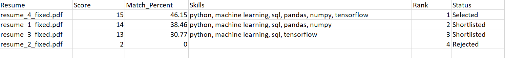
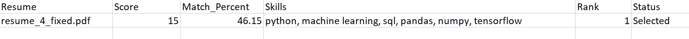
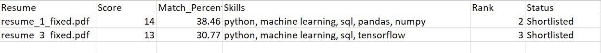
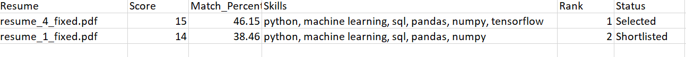
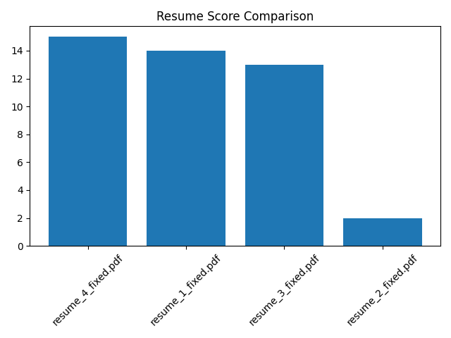

## 🚀 AI Resume Screening & Candidate Ranking System

An intelligent Resume Screening System that leverages Natural Language Processing (NLP) to automatically evaluate, rank, and shortlist candidates based on their similarity to a given Job Description.

---

## 📌 Overview

Recruiters often spend hours manually reviewing resumes.

This project automates that process by analyzing resumes and identifying the most relevant candidates using TF-IDF vectorization and Cosine Similarity.

It simulates a real-world Applicant Tracking System (ATS) used in modern hiring pipelines.

---

## ✨ Key Features

- 📄 Resume parsing (PDF & DOCX support)
- 🧹 Text cleaning and preprocessing
- 🧠 NLP-based similarity matching
- 📊 Resume ranking with scores (%)
- 🎯 Automatic candidate shortlisting
- 🔍 Matched keyword extraction
- 📈 Score visualization using graphs
- 📁 Auto-generated output files

---

## 🧠 How It Works

1. Job Description is processed and cleaned
2. Resumes are parsed and converted to text
3. TF-IDF vectorization converts text into numerical form
4. Cosine Similarity calculates relevance scores
5. Candidates are ranked based on similarity
6. Top candidates are shortlisted automatically

---

## 🛠️ Tech Stack

- Python
- Pandas
- Scikit-learn
- Matplotlib
- PDFPlumber
- python-docx

---

## 📂 Project Structure
```
resume-screening-ai/
│
├── data/
│   └── sample_job_description.txt
│   └──sample_resumes/
│      ├── resume1.pdf
│      ├── resume2.pdf
│      └── resume3.pdf
│      └── resume4.pdf
│
├── sample_outputs/
│   ├── results.csv
│   ├── shortlisted.csv
│   ├── top_candidates.csv
│   └── score_chart.png
│
├── main.py
├── requirements.txt
└── README.md
```
---

## ▶️ Getting Started

1️⃣ Clone the Repository
```
git clone https://github.com/needhi-x/resume-screening-ai.git
cd resume-screening-ai
```
2️⃣ Install Dependencies
```
pip install -r requirements.txt

```
3️⃣ Run the Project
```
python main.py

```
---

## 📊 Output Generated

After execution, the system creates:

- results.csv → All resumes with scores and rankings
- shortlisted.csv → Selected candidates
- top_candidates.csv → Top 3 candidates
- score_chart.png → Visual comparison of resumes

---
## 📸 Project Screenshots

### 🔹 All Results


### 🔹 Selected Candidates


### 🔹 Shortlisted Candidates


### 🔹 Top Candidates


### 🔹 Score Visualization


---

📌 Demo Data

This repository includes:

- 📄 Sample Job Description → "data/"
- 📁 Sample Resumes → "sample_data/"
- 📊 Generated Outputs → "sample_outputs/"

---

🚀 Future Enhancements

- 🔍 Skill-based semantic matching
- 🤖 Advanced NLP (BERT / embeddings)
- 🌐 Streamlit web application
- 📊 Interactive dashboard
- 🧾 Resume keyword highlighting

---

💼 Real-World Applications

- Applicant Tracking Systems (ATS)
- HR Tech Platforms
- Automated Resume Filtering Tools
- Recruitment Analytics Systems

---

👩‍💻 Author

Nidhi Apotikar

---

⭐ Support

If you found this project useful, consider giving it a ⭐ on GitHub!
